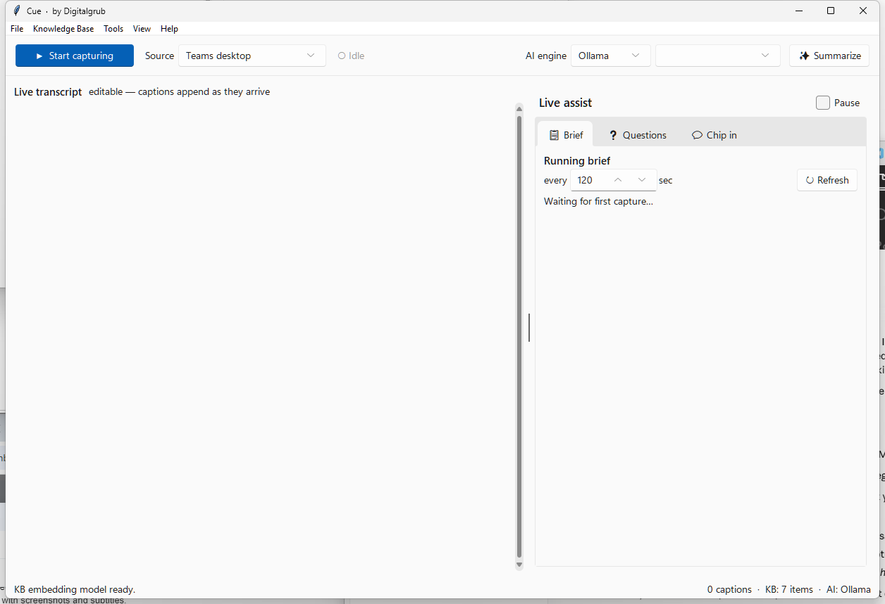

# Cue

**Your cue to speak.** · *by Digitalgrub*

Cue is a Windows desktop copilot for live meetings. It reads the meeting's captions
and, in a side panel, keeps three things up to date while you listen:

- 📋 **a running brief** of what has been discussed,
- ❓ **questions you could ask**, and
- 💬 **what you could say** — ready-to-speak lines, so you are never caught blank.

It can also **transcribe audio you already have**: a WhatsApp voice note, a phone
recording, a meeting export.

Everything is grounded in **your own documents**. It runs **fully local and free by
default** (Ollama + keyword retrieval) and works on a **small model** out of the box.
Claude and OpenAI are optional upgrades you turn on yourself.

> **New here?** [USAGE.md](USAGE.md) is a step-by-step walkthrough with no jargon.



---

## Contents

| | |
|---|---|
| [Install](#install) | Installer, or run from source |
| [Quick start](#quick-start) | First meeting in five steps |
| [Capture sources](#capture-sources) | Teams, any window, system audio |
| [Transcribe a file](#transcribe-a-file) | Voice notes and recordings |
| [AI engines](#ai-engines) | Local Ollama, or Claude / OpenAI |
| [Privacy and consent](#privacy-and-consent) | What leaves your machine, and the law |
| [Requirements](#requirements) | What you need installed |
| [Known limits](#known-limits) | Read this before filing a bug |
| [Documentation](#documentation) | Every doc in the repo |

---

## Before you start

**Windows 10 or 11 only.** Capture relies on Windows UI Automation. It does not run
on macOS or Linux.

You also need **[Ollama](https://ollama.com)**, the free local AI engine, installed
separately and running, with at least one model pulled. Without it, capture and
transcription still work, but the brief, questions and chip-in suggestions need
either Ollama or a Claude API key. A small model such as `llama3.2:1b` is enough;
Cue defaults to the smallest one you have installed.

Budget about 4 GB of free RAM for a small model, more for larger ones.

---

## Install

### Option A — Installer, no Python needed *(recommended)*

1. Install **[Ollama](https://ollama.com)**, pull a small model once
   (`ollama pull llama3.2:1b`), and open the Ollama app so it sits in your tray.
2. Download **`CueSetup.exe`** from the
   [latest release](https://github.com/Digitalgrub-Org/meeting-copilot/releases/latest)
   and run it. Per-user install, no admin prompt, with Start-menu and desktop shortcuts
   and a proper uninstaller.

> **Windows will warn you.** Releases are not yet code-signed, so SmartScreen shows
> "Windows protected your PC". Before choosing *More info → Run anyway*, check that the
> file matches the `CueSetup.exe.sha256` published beside it:
>
> ```powershell
> Get-FileHash CueSetup.exe -Algorithm SHA256
> ```
>
> Signing through [SignPath Foundation](https://signpath.org/) is in progress, which
> will remove the warning.

This build includes everything: Teams capture, Pick a window, system-audio capture,
file transcription, the knowledge base, and the assist panel. Speech models
(a few hundred MB) download the first time you use them.

> **Portable alternative:** run `Cue.exe` straight out of the `dist\Cue` folder. Zip
> and share the whole folder, since the `.exe` alone will not run.

### Option B — From source

```bash
git clone https://github.com/Digitalgrub-Org/meeting-copilot.git
cd meeting-copilot
pip install -r requirements.txt
python live_capture.py
```

Then install Ollama as above and pull a model:

```bash
ollama pull llama3.2:1b        # ~1.3 GB, runs on most laptops
ollama pull llama3.1           # ~4.7 GB, noticeably better output
```

**Pin `ctranslate2==4.4.0`.** Versions 4.5 and newer crash on model load in some
Windows environments, Anaconda especially, and take both speech features with them.
`requirements.txt` pins it; do not "upgrade" past it without testing. See
[CONTRIBUTING.md](CONTRIBUTING.md) for the details and a clean-environment recipe.

---

## Quick start

1. In your meeting, turn on **live captions**
   (Teams: **More ⋯ → Language and speech → Turn on live captions**).
2. In Cue, pick a **Source** and click **▶ Start capturing**.
3. Watch the three tabs on the right fill in: **Brief**, **Questions**, **Chip in**.
4. Hit **✨ Summarize** any time for a full structured summary.
5. Add reference material with **Knowledge Base → Add document…** so suggestions
   draw on your own specs and notes.

Got a recording instead of a live meeting? **File → Transcribe a file…** (`Ctrl+O`).

The brief refreshes every couple of minutes and skips a cycle until roughly 200
characters of new speech arrive, so give it a moment before deciding it is stuck.
The status bar tells you what capture is doing.

---

## Capture sources

| Source | How it works | Notes |
|---|---|---|
| **Teams desktop** | Finds Teams by process, then reads its captions pane via Windows UI Automation | Includes everyone, you too. Turn captions on in Teams first and leave the pane open. Works with the current Teams client, where captions live inside the meeting window rather than in a window of their own. |
| **Pick a window…** | Reads text from any window you choose, via UI Automation | Point it at any app showing a captions, subtitle or transcript pane, including browser and YouTube CC. Works when the app exposes real text, which most do. Subtitles *painted as pixels* (burned-in video subs, GPU overlays) are not readable this way. |
| **System audio (Whisper)** | Transcribes whatever plays through your speakers, locally | Works for **Teams / Meet / Zoom / anything**. Captures others' voices, not your own mic. First run downloads a model. Runs in its own process, so a speech-engine crash cannot take Cue down. |

Those three listen to audio happening *now*. For a file you already have, see below.

---

## Transcribe a file

**File → Transcribe a file…**, `Ctrl+O`, or the **Transcribe a file…** button. Built
for the everyday case: someone sends a voice note and you would rather read it.

1. **Browse…** and pick the file.
2. Leave **Quality** on *Balanced (small)* and **Language** on *Auto-detect*.
3. Press **▶ Transcribe**. Text streams in as it goes, and you can cancel at any
   point and keep what has already been transcribed.
4. Then **Copy**, **Save as…**, **Add to knowledge base**, **✨ Summarize**, or
   **Send to live transcript** to feed it into the assist panel.

**Formats** — anything ffmpeg can decode: `.opus` (WhatsApp voice notes), `.m4a`,
`.mp3`, `.wav`, `.aac`, `.flac`, `.amr`, plus video (`.mp4`, `.mov`, `.mkv`,
`.webm`). Save as `.txt`, `.md`, or `.srt` / `.vtt` subtitles. No system ffmpeg
needed; PyAV bundles its own.

### Getting a better transcript

| Control | What it does |
|---|---|
| **Quality** | `tiny` through `large-v3`. `small` is the sweet spot; step up for heavy accents or noisy recordings. Each model downloads once. |
| **Language** | *Auto-detect* handles mixed-language notes. Pin the language for short or noisy clips, where detection can wobble. |
| **Names / jargon** | The biggest single win. Type the people, products and acronyms you expect — `Contoso, Northwind, Atlas API, SKU` — and they get spelled correctly instead of phonetically. |
| **Show timestamps** | Prefix each paragraph with its start time. Toggle any time; it re-renders text you already have. |

Transcription runs **in a separate process**, so a crash in the native speech engine
surfaces as an error you can act on instead of closing Cue. It also runs **entirely
on your machine** — no audio is uploaded.

### Import a Teams recording's transcript

Teams shows a transcript beside every recording, but whether you may *download* it is
a tenant policy setting, and often the answer is no. The text is still on screen, and
the Teams desktop client exposes it through UI Automation — the same way Cue reads live
captions.

**Tools → Import Teams recording transcript…** Open the recording in the Teams desktop
app, click its **Transcript** tab, press **Start**, and leave Teams alone. Cue scrolls
the pane from top to bottom, reading at each step, and merges the passes into one
speaker-attributed, timestamped transcript. Then Copy, Save, add it to the knowledge
base, summarize it, or send it to the live transcript.

Why scrolling: the pane is virtualized, so only the entries currently on screen exist
in the accessibility tree — about two minutes of a two-hour meeting at a time.

> **If it reports an access violation:** that is the `ctranslate2` clash, not your
> file. Run `pip install "ctranslate2==4.4.0"`.

### Running the speech engine in its own environment

If you would rather not change your main environment, or it is Anaconda where the
native conflicts are worst, give the speech engine a dedicated virtual environment
and point Cue at it:

```bash
python -m venv D:\CueData\whisper-venv
D:\CueData\whisper-venv\Scripts\python.exe -m pip install faster-whisper "ctranslate2==4.4.0" "onnxruntime==1.18.1" soundcard
```

Then set **Settings → Transcribe → Python for transcription** to that
`python.exe`. Cue spawns it for speech work and leaves your main environment alone.

---

## AI engines

All configured in **Tools → Settings**.

| Use case | LLM | Retrieval | Cost |
|---|---|---|---|
| **Default — fully local** | Ollama (small model) | TF-IDF | $0 |
| Higher-quality output | Claude API | TF-IDF | ~$0.50–2 / meeting |
| Semantic document search | Ollama | OpenAI embeddings | <$0.01 / indexing |
| Best quality | Claude API | OpenAI embeddings | ~$0.50–2 / meeting |

Cue defaults to the **smallest** installed Ollama model so it runs on minimal
hardware. Turn that off in **Settings → LLM → Prefer a small model** to use the most
capable one you have instead. On a small model output is quick but basic; it sharpens
noticeably with `llama3.1` or Claude.

---

## Privacy and consent

Everything lives under `~/.meeting_workflow/`, or wherever `CUE_DATA_DIR` points:

- `kb.jsonl` — documents you added and transcripts you archived, as text
- `kb_openai_vecs.npy` — search vectors, only if OpenAI embeddings are enabled
- `config.json` — settings and any API keys, file mode 0600
- `whisper-models/` — downloaded speech models

No telemetry, no analytics, no account, no Digitalgrub server. Manage indexed content
via **Knowledge Base → Manage**.

**The one exception, so it is not a surprise:** if *you* enable a cloud backend, your
meeting text goes to that provider. Claude receives the transcript and relevant
document excerpts; OpenAI embeddings receive your document and transcript text. Both
are off by default and need an API key you supply. On the defaults nothing leaves the
machine.

### Recording other people

Cue transcribes what other participants say. In many places doing that without their
consent is unlawful, and the rules vary by country, state and employer. Tell people
you are capturing the meeting and get their agreement first. Cue grants you no
permission you do not already have.

Full detail in [PRIVACY.md](PRIVACY.md).

---

## Requirements

- Windows 10 or 11, 64-bit
- Python 3.10+ *(source only; the installer needs none)*
- [Ollama](https://ollama.com) with at least one model pulled, for the AI features
- *(Optional)* Anthropic API key, for Claude
- *(Optional)* OpenAI API key, for semantic embeddings

Running from source and want speech? `pip install faster-whisper "ctranslate2==4.4.0"
"onnxruntime==1.18.1" soundcard`.

---

## Known limits

- Capture is Windows-only. The **System audio** source covers meetings on any
  platform, but Cue itself needs Windows.
- The Whisper sources capture others' voices, not your own microphone.
- Speaker attribution from captions is approximate, and audio transcription has no
  speaker labels at all. Diarization would pull in the PyTorch stack this project
  deliberately avoids.
- Local semantic embeddings (sentence-transformers, Chroma) are disabled: they
  segfault on Anaconda + Tk. Cue uses TF-IDF locally, or OpenAI embeddings with a key.
  See [TECHNICAL.md](TECHNICAL.md).
- `ctranslate2` 4.5 through 4.7 crash on model load in some Windows environments.
  Pin 4.4.0. Both speech features run isolated, so you get that message rather than a
  closed app.
- Opening a WASAPI loopback device is wildly variable: instant on Bluetooth
  headphones, up to ~95s on HDMI audio, and it can block indefinitely on an output
  with no active sound, such as a sleeping monitor. Cue reports progress and gives up
  after 150s with instructions. Set your real listening device as the Windows default.
- For an authoritative full transcript, use Teams' own transcript download.

---

## Documentation

| Doc | What's in it |
|---|---|
| [USAGE.md](USAGE.md) | Step-by-step guide, no jargon, plus troubleshooting |
| [TECHNICAL.md](TECHNICAL.md) | Architecture, the worker-process boundary, design decisions |
| [CONTRIBUTING.md](CONTRIBUTING.md) | Dev setup, the dependency traps, running the tests |
| [PRIVACY.md](PRIVACY.md) | What is processed, stored, and sent where |
| [STORE.md](STORE.md) | Microsoft Store submission requirements and status |
| [SECURITY.md](SECURITY.md) | Reporting a vulnerability |
| [THIRD-PARTY-NOTICES.md](THIRD-PARTY-NOTICES.md) | Bundled components and their licenses. **Read before distributing binaries.** |
| [CHANGELOG.md](CHANGELOG.md) | What changed, and when |

---

## Contributing

Bug reports and pull requests welcome. Start with
[CONTRIBUTING.md](CONTRIBUTING.md) — it covers the environment traps that will
otherwise cost you an afternoon.

## License

MIT — see [LICENSE](LICENSE). © 2026 Digitalgrub.

The packaged build bundles third-party components under their own licenses, listed in
[THIRD-PARTY-NOTICES.md](THIRD-PARTY-NOTICES.md). If you redistribute the installer,
ship that file with it and read the FFmpeg section first.
